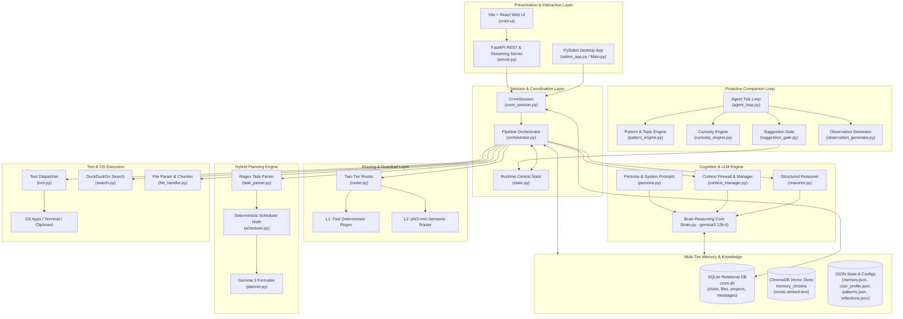

### Architectural Overview

**Croni** is a privacy-first, local-first personal AI assistant and proactive companion. It is architected around a dual-model LLM inference pipeline running locally via **Ollama**, an event-driven session coordinator, multi-tiered semantic and relational memory, deterministic symbolic engines (for math/scheduling), and an autonomous background companion loop.

---

### System Architecture Diagram

---

### Core Architectural Subsystems

#### 1. Presentation & Interface Layer
* **Native Desktop Client ([Main.py](file:///c:/Users/kk141/source/repos/Croni-01/Croni-01/Main.py), [native_app.py](file:///c:/Users/kk141/source/repos/Croni-01/Croni-01/native_app.py))**:
  * The primary interface built with PySide6 (Qt for Python).
  * Implements desktop capabilities: system tray integration, window animations, presence status indicator ([presence_service.py](file:///c:/Users/kk141/source/repos/Croni-01/Croni-01/presence_service.py)), multi-chat tabs, draft persistence, file drop targets, and streaming token rendering via background worker threads.
* **Web UI & Server ([server.py](file:///c:/Users/kk141/source/repos/Croni-01/Croni-01/server.py), `croni-ui/`)**:
  * An optional headless / browser architecture.
  * A FastAPI backend exposing streaming SSE endpoints, file uploads, project management, and chat operations, accompanied by a modern React + Vite frontend (`croni-ui`).

#### 2. Session Coordinator & Central State
* **Session Manager ([croni_session.py](file:///c:/Users/kk141/source/repos/Croni-01/Croni-01/croni_session.py))**:
  * Acts as the stateful bridge between user interfaces and the processing pipeline.
  * Manages chat workspaces, project linking, draft commits, attachment staging, thread-safe response streaming, and stream cancellation flags.
* **Unified Runtime State ([state.py](file:///c:/Users/kk141/source/repos/Croni-01/Croni-01/state.py))**:
  * Zero-dependency singleton (`_RuntimeState`) holding volatile in-memory state: last executed tool outcomes, active plan metadata, cancellation signals, confirmation gates, and proactive companion notes.

#### 3. Intent Routing & Guardrails ([router.py](file:///c:/Users/kk141/source/repos/Croni-01/Croni-01/router.py))
Croni employs a **two-tier tiered routing system** to minimize latency:
1. **Layer 1 (Deterministic Rules)**: Regex pattern matching for explicit actions (`remember`, `forget`, `open <app>`, `read file`, `search web`, danger commands like `format disk` or `shutdown`). Runs with zero inference overhead (<1ms).
2. **Layer 2 (Semantic Classification)**: Inputs not matched by heuristics route to a lightweight, fast local model (`phi3-mini`) via Ollama. It outputs structured JSON classifying intents (`chat`, `explain`, `tool`, `search_web`, `plan`, `danger`).
3. **Danger Gate**: High-risk system actions trigger a `needs_confirmation` flag, requiring user approval before execution.

#### 4. Cognitive & Reasoning Core
* **Main Inference Engine ([brain.py](file:///c:/Users/kk141/source/repos/Croni-01/Croni-01/brain.py))**:
  * Powered by `gemma3:12b-it-q4_K_M` running locally in Ollama with an 8192-token context window.
  * Manages per-chat conversation history buffers.
  * Implements auto-summarization (`SUMMARIZE_EVERY = 5` turns) and hard context trimming (`HARD_TRIM_AT = 20`) to prevent context rot and memory blowout.
* **Structured Reasoner ([reasoner.py](file:///c:/Users/kk141/source/repos/Croni-01/Croni-01/reasoner.py))**:
  * Uses keyword & multi-sentence complexity heuristics (`is_complex`).
  * For complex questions (debugging, architecture, tradeoffs), generates an internal reasoning chain before final response generation. The reasoning serves as scaffolding and is omitted from the conversational stream.
* **Context Firewall ([context_manager.py](file:///c:/Users/kk141/source/repos/Croni-01/Croni-01/context_manager.py))**:
  * Filters and caps prompt bloat before it hits Gemma 3.
  * Dynamically scales context sizes depending on intent (e.g. strict trims for casual chat; higher limits for uploaded file analysis).
* **Persona & Style Reference ([persona.py](file:///c:/Users/kk141/source/repos/Croni-01/Croni-01/persona.py), [example_chats.py](file:///c:/Users/kk141/source/repos/Croni-01/Croni-01/example_chats.py))**:
  * Injects grounding directives, tone constraints, and few-shot stylistic examples.

#### 5. Hybrid Planning Engine ([planner.py](file:///c:/Users/kk141/source/repos/Croni-01/Croni-01/planner.py))
Rather than letting an LLM hallucinate schedules and mathematical calculations:
* **[task_parser.py](file:///c:/Users/kk141/source/repos/Croni-01/Croni-01/task_parser.py)** parses quantitative constraints (days, hours, chapters, progress).
* **[scheduler.py](file:///c:/Users/kk141/source/repos/Croni-01/Croni-01/scheduler.py)** performs purely mathematical chapter queueing, priority scoring (`deficit_ratio`), block balancing, and exact sum verification in pure Python.
* **[planner.py](file:///c:/Users/kk141/source/repos/Croni-01/Croni-01/planner.py)** uses Gemma 3 strictly as a formatter to render the computed schedule into Markdown.

#### 6. Multi-Tiered Memory Architecture
Memory is strictly separated into distinct layers by volatility and purpose:
* **Relational Storage ([database.py](file:///c:/Users/kk141/source/repos/Croni-01/Croni-01/database.py))**:
  * SQLite (`croni.db`) handles structured entities: `chats`, `messages`, `projects`, `project_files`, `chat_files`, and persistent notes.
* **Vector Semantic Retrieval ([memory.py](file:///c:/Users/kk141/source/repos/Croni-01/Croni-01/memory.py))**:
  * Uses **ChromaDB** with `nomic-embed-text` embeddings.
  * Employs an in-memory embedding cache and incremental synchronization (only embedding newly added records).
  * Automatically falls back to keyword BM25/scoring if ChromaDB or the embedding model is offline.
* **Long-Term User Profile ([croni_profile.py](file:///c:/Users/kk141/source/repos/Croni-01/Croni-01/croni_profile.py))**:
  * Durable JSON profile (`user_profile.json`) storing name, role, communication preferences, and explicit privacy boundaries.

#### 7. Proactive Companion Architecture
Croni operates continuously even when the user is silent via [agent_loop.py](file:///c:/Users/kk141/source/repos/Croni-01/Croni-01/agent_loop.py):
* **[pattern_engine.py](file:///c:/Users/kk141/source/repos/Croni-01/Croni-01/pattern_engine.py)**: Tracks user topics, repeated project visits, intent patterns, and habit sequences in `patterns.json`.
* **[reflection_store.py](file:///c:/Users/kk141/source/repos/Croni-01/Croni-01/reflection_store.py)**: Distills raw patterns into higher-level themes (e.g., AI agents, software building, physics) in `reflections.json`.
* **[curiosity_engine.py](file:///c:/Users/kk141/source/repos/Croni-01/Croni-01/curiosity_engine.py)**: Selectively triggers thoughtful check-in questions under strict rate limits (max 2 per day total, max 1 per chat).
* **[suggestion_gate.py](file:///c:/Users/kk141/source/repos/Croni-01/Croni-01/suggestion_gate.py) & [observation_generator.py](file:///c:/Users/kk141/source/repos/Croni-01/Croni-01/observation_generator.py)**: Generates unprompted contextual workspace suggestions and opening observations while respecting user activity thresholds.

#### 8. Tool Execution & OS Integration ([tool.py](file:///c:/Users/kk141/source/repos/Croni-01/Croni-01/tool.py))
* **Application Launching**: Shell execution with verification via Windows `tasklist` checks (e.g., VS Code, Chrome, Notepad).
* **Filesystem Operations**: Sandboxed reading, listing directories, and writing files with path resolution checks.
* **Web Search ([search.py](file:///c:/Users/kk141/source/repos/Croni-01/Croni-01/search.py))**: DuckDuckGo search integration for up-to-date web information.
* **Document Parsing ([file_handler.py](file:///c:/Users/kk141/source/repos/Croni-01/Croni-01/file_handler.py))**: Extracts text from `.txt`, `.py`, `.json`, `.csv`, `.docx`, `.pdf`, etc., injecting file context directly into conversation turns.

---

### Architectural Highlights

| Design Aspect | Implementation |
| :--- | :--- |
| **Model Specialization** | Small, fast model (`phi3-mini`) for intent classification; capable 12B model (`gemma3:12b-it`) for reasoning and chat; dedicated embedding model (`nomic-embed-text`) for vector search. |
| **Reliability via Determinism** | Mathematical calculations, scheduling, and command execution are performed deterministically in Python rather than being delegated to LLM generation. |
| **Local & Private** | Zero reliance on external paid APIs; runs on local Ollama server, local SQLite database, and local vector embeddings. |
| **Stream Management** | Custom thread-level stream interceptor ([stream_bridge.py](file:///c:/Users/kk141/source/repos/Croni-01/Croni-01/stream_bridge.py)) feeding Qt UI signals or SSE endpoints asynchronously with instant cancellation support. |